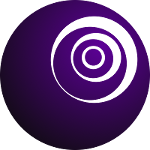

Mana Project
===
<center>

</center>

Mana project focuses around building Mana programming language.
Mana is a general purpose programming language to build robust 
and scalabe concurrent applications from web servers, desktop 
applications and high-performance/scientific computing.

## Mana Programming Language
Mana aims to be a general purpose language, emphasizing immutability and safe
code writing. 

Among the notable Mana featuers are:

- Multi-paradigm:
	- Object Oriented
	- Functional
	- Generic
	- Concurrent
- No exception (yes it is a feature)
- Static and strong typing
- Immutability by default
- Safe, no null references (not even a `null` keyword)
- Native interface MNI (Mana native interface)

## Sponsor the project
If you believe this project holds some potential (which I obviously believe) feel free contact me at [schouri@praisethemoon.org](schouri@praisethemoon.org).

## Design Blog Posts
These some articles about mana design posted in my blog at [https://blogs.praisethemoon.org](https://blogs.praisethemoon.org).
Note that mana design is still work in progress, there is not even a compiler yet. You might find some different standard library calls and imports. What matters is just the concept.

### [Mana for high-performance computing](https://blog.praisethemoon.org/2017/06/11/mana-for-high-performance-computing-concept-wip/)
**Published on: Jun 11, 2017 @ 08:28**

Using Mana annotation features, high-performance computing can become a simple task.

Mana will natively support OpenCL if i is available, or it would simply run a kernel on various CPU threads if it is not available.

```ml
import(
   mana.lang.*
   mana.Math
   mana.hpc[Kernel, KernelTarget]
)

/*
 * Sums two vectors
 * w = u + v
 */

@Kernel(target=KernelTarget.GPU)
fn vectorSum(@Global u: u32[], @Global v: u32[], @Global w: u32[]) {
   let @GlobalID i: u64
   w[i] = u[i] + v[i]
}

fn TestVectorSum() {
   let u, v, w: u32[256]

   foreach i: u8 in Range(0, 255) {
      u[i] = Math.random(0, 1000)
      v[i] = Math.random(0, 1000)
   }

   @KernelInvoke
   vectorSum(u, v, w)

   foreach i:u32 in w do {
      stdio.print("${u[i]} + ${v[i]} = ${w[i]}")
   }
}
```

The compiler is able to generate appropriate SPIR-V kernel. There are few limitations regarding the kernel, the parameters passed must not be objects. Since object would translate into structures and structures and not very friendly when being passed between CPU and GPU.

### [Mana Sample - RGB to HSV](https://blog.praisethemoon.org/2017/06/10/mana-sample-rgb-to-hsv/)
**Published on: Jun 10, 2017 @ 14:11**

I have been struggling to find a good syntactic design for Mana programming language. And I came into conclusion, almost everything that can be a statement can be an expression, even match statements, if, else etc. The only exception would be loops , as they can be represented as recursive functions.

So I decided to present a snippet to demonstrate how powerful expressions can be. In the following example, both match and if-else are used as expressions, meaning they can be used inside operators, function parameters, etc. The example is a demonstration of RGB to HSV color space conversion, the formula can be found here: [http://www.rapidtables.com/convert/color/rgb-to-hsv.htm](http://www.rapidtables.com/convert/color/rgb-to-hsv.htm).

```ml
import(
   mana.lang
   mana.io
   mana.Math
)

class RGBColor {
   local r, g, b: u8

   local fn debug() = stdout.println("<${r}, ${g}, ${b}>")
   local fn getRGB() = (r, g, b) // (u8, u8, u8)
   local fn setRGB(colors: (u8, u8, u8)) = (r, g, b) = colors

   local fn toHSV() -> (u16, f32, f32) {
      let r1 = r/255.0
      let g1 = g/255.0
      let b1 = b/255.0
      
      let cmax = Math.max(r1, g1, b1)
      let cmin = Math.min(r1, g1, b1)
      
      let delta = cmax-cmin
      
      let h = 
         if delta == 0: 
            0
         else:
            60 * match cmax {
               r1: ((g1 - b1)/delta) % 6
               g1: (b1 - r1)/delta + 2
               b1: (b1 - g1)/delta + 4
               else: 0 // unreachable
            }
      
      let s = 
         if cmax == 0:
            0
         else:
            delta/cmax
      
      let v = cmax
      
      return (h as u8, s, v)
   }
}
```

### [Mana, the end of the beginning](https://blog.praisethemoon.org/2017/04/07/mana-the-end-of-the-beginning/)
**Published on: Apr 7, 2017 @ 14:07**

#### How it all started:
I have been designing this language for a very long time and now it's time I make it clear with myself and others why (again) do we need another programming. Again, I don't feel comfortable with any of the existing programming languages, so I decided to roll my own. As I research into compiler construction, I discovered various programming paradigms and languages that I didn't know about. I learned functional programming, JIT, how OS and compilers work and more great things such as LLVM, VM design, various optimizations. I kept searching for a good backend for my compiler LLVM, libfirm, C, roll my own VM etc. I haven't considered .NET's CLR or the JVM as I believe there are enough languages targeting these platforms. So I think I have researched enough, it's been about 5 years as I am writing this article and I have enough ideas ready to be implemented to design the language that I believe would achieve higher level goals.

#### The end of the beginning
Mana is a general purpose programming language targeting application level development (Desktop, Mobile, Backend). Mana is multi-paradigm featuring:

- Object Oriented
- Functional
- Concurrent
- Generic
- Imperative

The biggest challenge I faced while developing Mana's syntax was how would all these paradigms fit together without having an ambiguous and/or ugly syntax. Many OOP language like Java or C++ adopted some functional programming features and the way it was integrated into the language it self seemed weird and some how unfit/unpleasant. By unpleasant, I mean to both the developer (Weird syntax, probably unreadable code) and even the machine (leads to non-optimized code). So how would a Mana hello world look like?

#### Hello world

```ml
import (
  mana.stdio.Console
  mana.lang.*
)

function main(args: String[]) -> u32 {
  stdio.println("Hello, World!")
  return 0
}
```

#### Mana Unique Features
Mana's mix of various paradigms adds powerful features within the language, especially that almost every mechanism is backed by a class/interface and allows great flexibility. For example, pattern matching can be applied even to a custom class, if the programmer implements PatternMatchable Interface.

Mana does not allow class inheritance. This is a forced pattern, which I usually call interface-oriented programming, which makes code easier to evolve. The programmer has two options: Either implement an interface and all its methods or prefer composition over inheritance in the first place.

This pattern will lead to writing minimum classes and use them upon need, and stop abusing class inheritance which avoids a lot of problems such as state hiding, etc.

Interface-oriented pattern along with composition will lead to highly coupled components and complex architecture but it is much better than bloated classes and unclear architecture.

Example:

```ml
class CustomUIButton implements AbstractUIBotton {
       uiRenderer: UIB::UIRenderer = UIComponents::UIB::DefaultButtonRenderer
       eventHandler: UIB::EventHandler = new CustomUIButtonEventHandler()

       fn getUIRenderer() -> UIB::UIRenderer = uiRenderer
       fn getEventHandler() -> UIB::EventHandler = eventHandler
}
```

Here we create a custom UIButton inheriting the default renderer. We changed the architecture from a button having a draw method (inherited from AbstractUIButton) to a button having a rendering behavior (composition).

#### Conclusion
All the points mentioned above can be added to any language via programming patterns, but Mana attempts to make these patterns more solid and mandatory to allow better code writing and reusability.